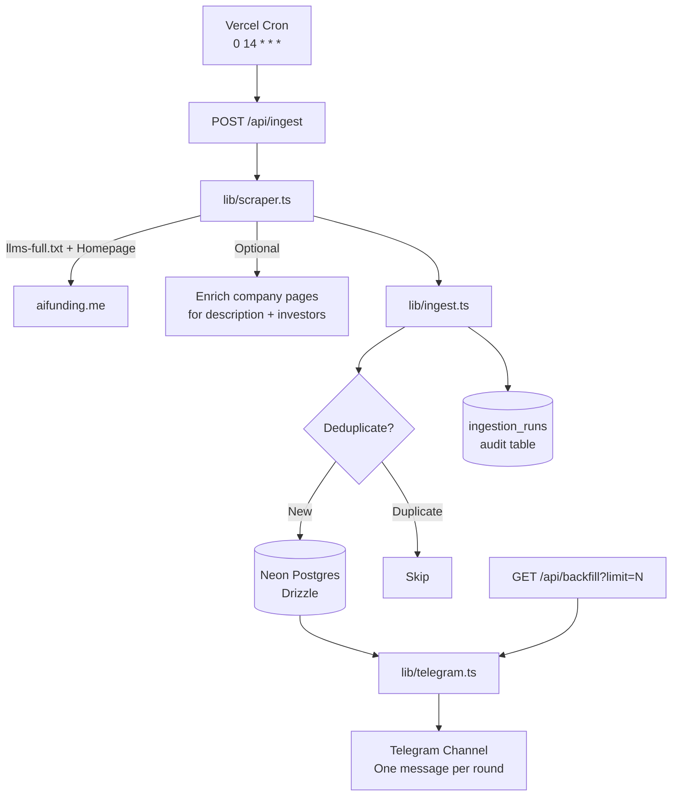

# AI Funding Daily

Production-grade daily AI fundraising intelligence system.

The system automatically scrapes [aifunding.me](https://aifunding.me), stores structured funding rounds in Neon Postgres, and posts **one clean Telegram message per new funding event** to a channel (modeled after successful crypto fundraising channels).

## What it does

- Daily scrape of AI funding activity
- Deduplicated storage of rounds + companies
- One individual Telegram message per new round (no batching)
- Optional backfill for historical data
- Fully automated via Vercel Cron

## Tech Stack

- **Next.js 16** (TypeScript, App Router)
- **Neon Postgres** + **Drizzle ORM**
- **Grammy** (Telegram bot framework)
- **Vercel** (hosting + Cron jobs at 14:00 UTC)
- Lightweight scraping (fetch + cheerio on `llms-full.txt` + homepage)

---

## Architecture



**Key flows:**
- **Daily run**: Cron → `/api/ingest` → scrape → dedupe → store → (if new) enrich → post to Telegram
- **Backfill**: Manual trigger to post historical rounds with rich formatting
- **Enrichment** happens on-demand when posting (visits company pages for description + lead investors)

---

## Local Development Setup

### 1. Clone and install

```bash
git clone https://github.com/gatesyp/ai-funding-daily.git
cd ai-funding-daily
npm install
```

### 2. Environment Variables

Create a `.env.local` file:

```env
DATABASE_URL="postgresql://..."
TELEGRAM_BOT_TOKEN="123456:ABC-..."
TELEGRAM_CHANNEL_ID="-1003920707625"
INGEST_SECRET="your-long-random-string"
```

See the detailed "How to get each value" section below.

### 3. Run locally

```bash
npm run dev
```

### 4. Useful local commands

```bash
# Normal daily job
curl -X POST "http://localhost:3000/api/ingest?secret=YOUR_SECRET"

# Backfill recent data (great for initial setup)
curl "http://localhost:3000/api/backfill?limit=30&secret=YOUR_SECRET"

# Test Telegram only
curl "http://localhost:3000/api/test-telegram?secret=YOUR_SECRET"
```

---

## Telegram Bot Setup

1. Create a bot with [@BotFather](https://t.me/BotFather) → `/newbot`
2. Create your channel and add the bot as **Administrator** with "Post Messages" rights
3. Get the Channel ID by forwarding a message to [@userinfobot](https://t.me/userinfobot)
4. Add the token and channel ID to your environment variables

---

## Adding New Data Sources

The current system is designed around **aifunding.me** as the primary (and currently only) source.

### Where to extend

- **Primary scraper logic**: `lib/scraper.ts`
- **Ingestion orchestration**: `lib/ingest.ts`
- **Data models**: `db/schema.ts`

### Recommended approach for a new source

1. Create a new file under `lib/scrapers/` (e.g. `newsource.ts`)
2. Implement a function that returns normalized data in the shape expected by `ingest.ts` (or adapt the ingest layer).
3. Add a new API route or extend the existing `/api/ingest` to accept a `source` parameter.
4. Update deduplication logic if the new source has different uniqueness rules.
5. Add a new table or use the flexible `raw_data` JSONB column for source-specific fields.

**Important principles**:
- Keep the daily cron focused and reliable.
- New sources should be pluggable without breaking the existing Telegram posting format.
- Always enrich with description + investors when possible before posting.

---

## For AI Agents & Other LLMs

If you are an AI agent (Claude, Cursor, Grok, etc.) that has been asked to work on this project, please read this section carefully.

### Project Goals (for context)

- Reliable daily delivery of individual AI funding announcements via Telegram
- High signal, low noise (one message per real new round)
- Clean, maintainable TypeScript codebase
- Easy for humans and agents to extend

### Quick Start for an Agent

To set up this project from scratch:

```bash
git clone https://github.com/gatesyp/ai-funding-daily.git
cd ai-funding-daily
npm install
```

You will need four environment variables (see the Local Development Setup section above for exact instructions):

- `DATABASE_URL` (Neon)
- `TELEGRAM_BOT_TOKEN`
- `TELEGRAM_CHANNEL_ID`
- `INGEST_SECRET`

Create a `.env.local` file with these values.

Then run:

```bash
npm run dev
```

### Most Important Files for Agents

| File                        | Why it matters                                      |
|----------------------------|-----------------------------------------------------|
| `lib/scraper.ts`           | All data acquisition logic + enrichment             |
| `lib/ingest.ts`            | The core "brain" – deduplication and flow control   |
| `lib/telegram.ts`          | Message formatting and delivery                     |
| `app/api/ingest/route.ts`  | The main daily entrypoint                           |
| `app/api/backfill/route.ts`| Historical / bulk posting (very useful for testing) |
| `db/schema.ts`             | Database shape                                      |

### Common Pitfalls (tell the agent about these)

- Telegram rate limits when sending many messages quickly (use the built-in 800ms+ delay)
- The bot must be an **admin** of the channel with posting rights
- Some companies legitimately have no public investors listed
- The first time you run the system it will ingest hundreds of "latest" rounds — use `/api/backfill` for controlled posting
- Never commit real secrets (`.env.local` is gitignored)

### Recommended Workflow for Agents

1. Understand the current flow by reading `lib/ingest.ts` first.
2. Make changes in small, testable increments.
3. Use the `/api/backfill?limit=5` endpoint heavily while developing new features.
4. Always test Telegram output format with `/api/test-telegram`.
5. Update this README when adding significant new capabilities.

### Questions an agent should ask the user

- Do you want a new data source added, or improvements to the existing one?
- Should new sources also post to the same Telegram channel?
- Do you want richer data (full funding history, valuations over time, etc.)?

---

## Deployment (Vercel + GitHub)

The project is connected to GitHub at:
**https://github.com/gatesyp/ai-funding-daily**

Pushes to `main` will trigger deployments on Vercel (once the GitHub integration is connected in the Vercel dashboard under Settings → Git).

### Required Vercel Environment Variables

- `DATABASE_URL`
- `TELEGRAM_BOT_TOKEN`
- `TELEGRAM_CHANNEL_ID`
- `INGEST_SECRET`

### Cron

Runs every day at **14:00 UTC** via `vercel.json`.

---

## API Endpoints

| Endpoint                        | Use Case                                      | Protected |
|--------------------------------|-----------------------------------------------|---------|
| `POST /api/ingest`             | Daily job (scrape + store + post)             | Yes     |
| `GET /api/backfill?limit=XX`   | Force post N recent rounds with enrichment    | Yes     |
| `GET /api/test-telegram`       | Verify bot can post                           | Yes     |
| `GET /api/health`              | Health check                                  | No      |

---

## Important Notes

- Deduplication key = company + round type + amount
- Enrichment (description + investors) happens on company pages when posting
- Some rounds will say "Investors not disclosed" — this is expected
- Change the default `INGEST_SECRET` before going to production

---

The repository is public: https://github.com/gatesyp/ai-funding-daily

Feel free to share it with your cofounder or other AI agents.
